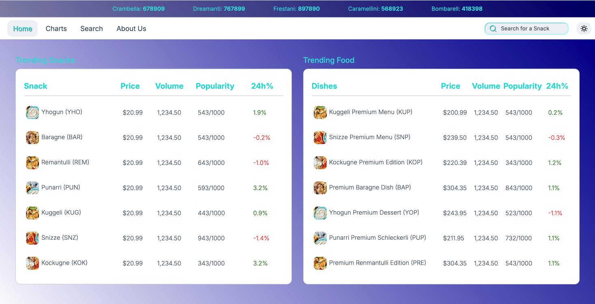
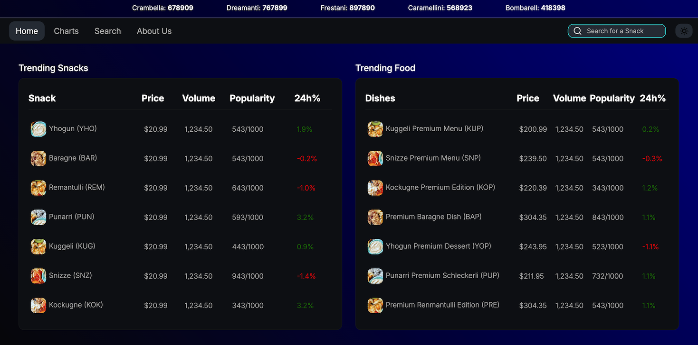

# table-switch

Marketplace spreadsheet with dark theme switch written in Vanilla JavaScript.

## Usage

Press the light bulb button in the top right corner to switch between light and dark mode.

## Contact

Created and maintained by [Tiziano Preisig](tiziano.preisig2@gmail.com) - Let's connect and build together!

