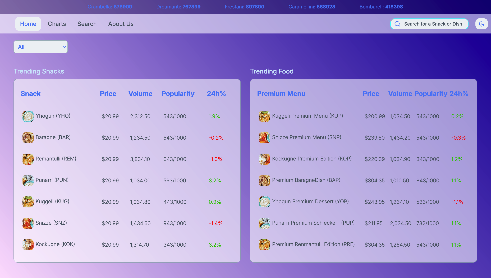
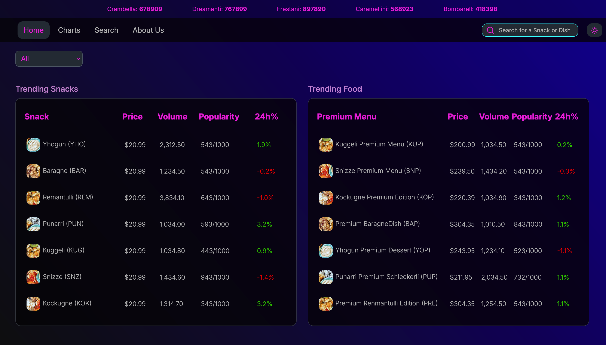

# Snack and Dish Dashboard

A web application to display trending snacks and dishes with filtering and search functionality.

## Features

- **Responsive Design**: Adapts to various screen sizes.
- **Dark/Light Theme**: Toggle between themes (implemented in `script.js`).
- **Category Filter**: Filter items by snacks or food.
- **Search Functionality**: Search for snacks or dishes (implemented in `script.js`).
- **Interactive Tables**: Displays trending snacks and dishes with details like price, volume, popularity, and 24-hour change percentage.

## Style

## Contact

Created and maintained by tpreisig - Let's connect and build together!
